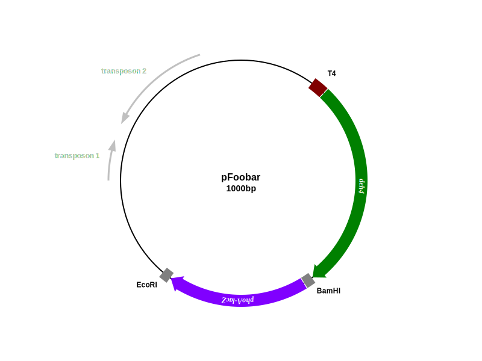

# FlexiPlasmidDraw
__Client-side standalone__ Plasmid illustration drawing(SVG) for biotech/educational use.

Created in 2008, before the HTML5 or whatever JS framework era.

This is a javascript-based tool for drawing plasmid and retriving the image as vector SVG commands. Useful for quickly creating an illustration for presentation use, or __when the actual DNA sequence does not matter__.

SVG file can be edited using WYSIWYG editor Inkscape or Illustrator, or even a plain text editor, and can be enlarged without degrading image quality.

You can [download everything](https://github.com/MaverickTse/FlexiPlasmidDraw/archive/master.zip) on to your own PC and then just run __index.html__, then select either [2017](https://www.mavtse.com/FlexiPlasmidDraw/FlexiPlasmidDraw2017.html) OR [Basic](https://www.mavtse.com/FlexiPlasmidDraw/TYMPlasmidDraw.htm) OR [Deluxe](https://www.mavtse.com/FlexiPlasmidDraw/FlexiPlasmidDraw%20v2%20Deluxe.xhtml) version to run.

All modern browsers as of 2015 should be able to render SVG so you can forget about the Basic version actually.

MIT license. Donation welcome (paypal at: mavericktse@ gmail .com ).

Originally published on my blog at [http://mavericktse.mooo.com/] → now [https://www.mavtse.com]

## Use case
* SlideShow presentation
* Thesis and Journal publication
* Conference poster

## 2017 Patch
* Completely resolved the "curved text" alignment issue
* Added CJK (中日韓) text support
* Added HTML5 UI with direct SVG and PNG download function

## Difference from other tools
* Vector NTI/pDraw and other payware: This is free and better suitable for simple illustration purpose, no actual DNA sequence needed
* Savvy: This is client-side only and offer more features (man, this worth a publication!? what a joke)
* AngularPlasmid: This is more light-weight and gives you the actual SVG code, but less features
* All Others: This is more than a plasmid tool. You can use it for other illustrations or art that base on circles and sectors

